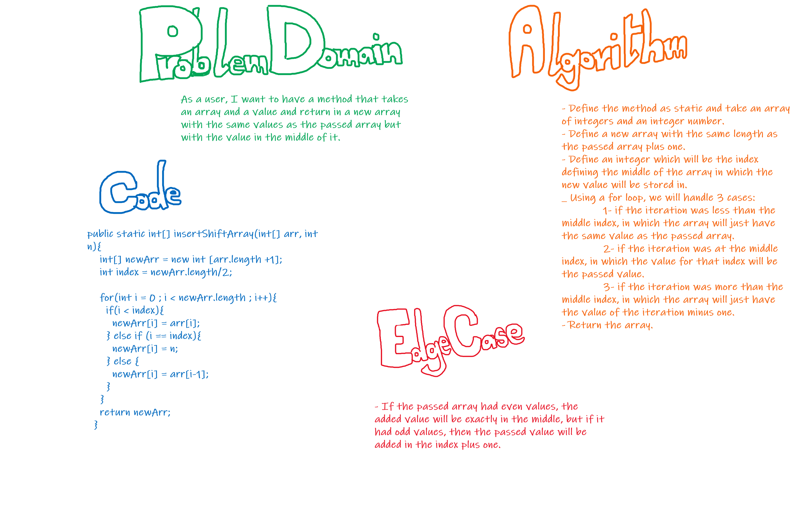

# Insert to Middle of an Array
**As a user, I want to have a method that takes an array and a value and return in a new array with the same values as the passed array but with the value in the middle of it.**

## Whiteboard Process
