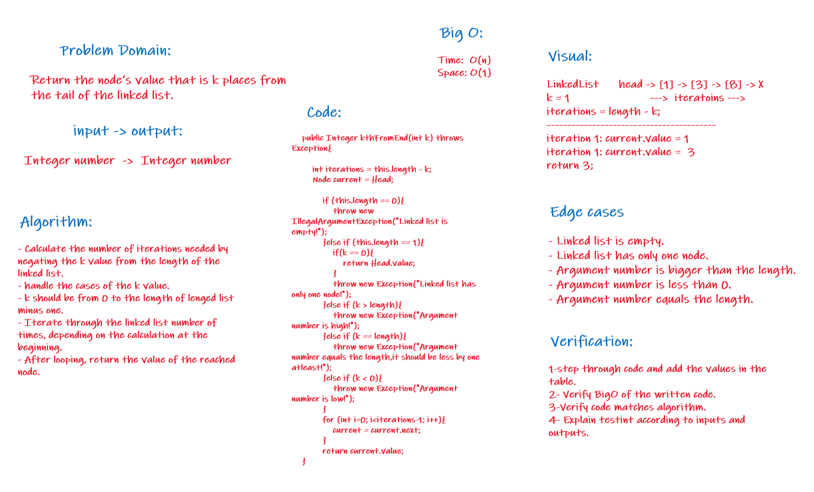
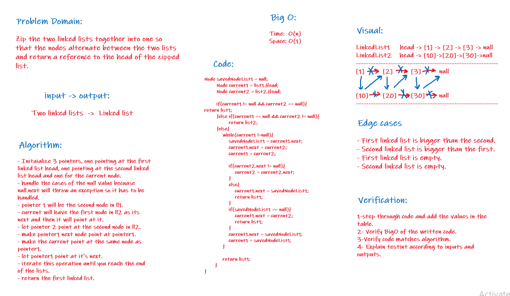

# SinglyLinkedLists:
**Creating Node class, LinkedList class and instantiate a linked list in the main**

### CodeChallenge05:
**The linked list should contain the following methods with their tests:**
+ insert: takes an integer and creates a new node into the linked list holding that value.
+ includes: checks if a certain value is in one of the nodes in the linked list.
+ toString: returns a String including all the values of the linked list nodes.

### CodeChallenge06:
**The linked list should contain the following methods with their tests:**
+ append: adds a node as a last node in the linked list holding a given value.
+ insertBefore: adds a node into the linked list before a value that is passed to the method and holds the given value.
+ insertAfter: adds a node into the linked list after a value that is passed to the method and holds the given value.

### CodeChallenge07:
**The linked list should contain the following methods with its tests:**
+ kthFromEnd: return the node’s value that is k places from the tail of the linked list.

##### White board for codeChallenge07:

### CodeChallenge08:
**The linked list should contain the following methods with its tests:**
+ zipLists: Zip the two linked lists together into one so that the nodes alternate between the two lists and return a reference to the head of the zipped list.

##### White board for codeChallenge8:

## Setup:
1. $cd to the directory that has the java files.
2. In the terminal, run $javac directoryName(e.g inheritance)/*.java
3. run the command $java directoryName(e.g inheritance).MainClass(e.g Library)
   
   **And the output will be shown in the terminal.**

### To test the code:
+ In the project directory in the terminal, use the command $./gradlew test
+ It should test the code and give you a build successful if everything tested right.

