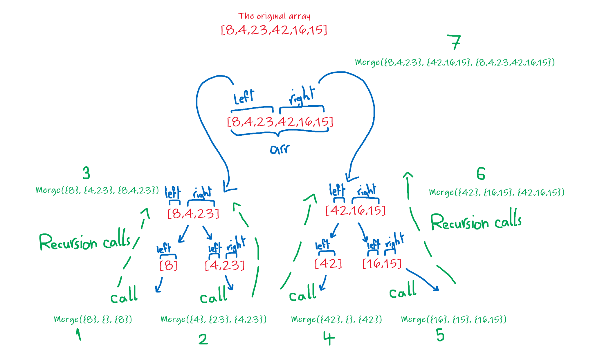
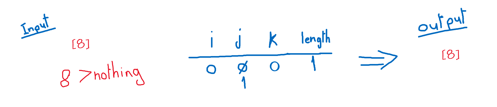
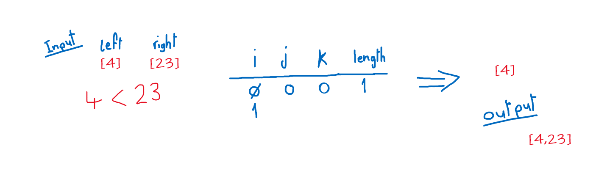
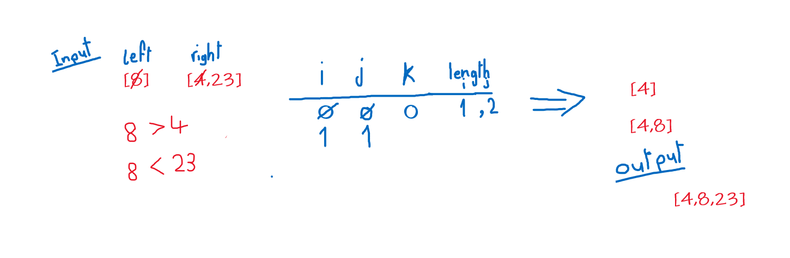
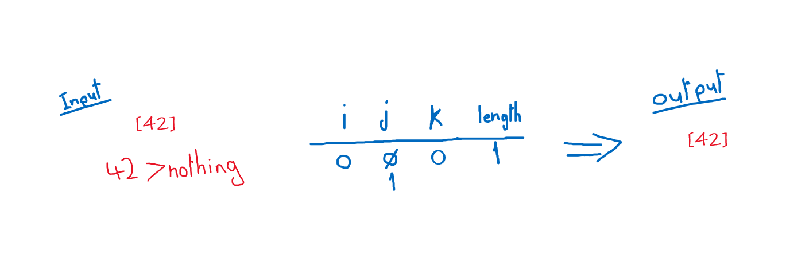
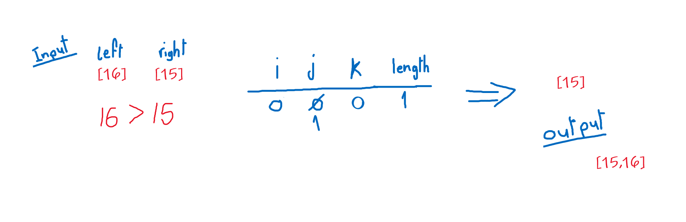
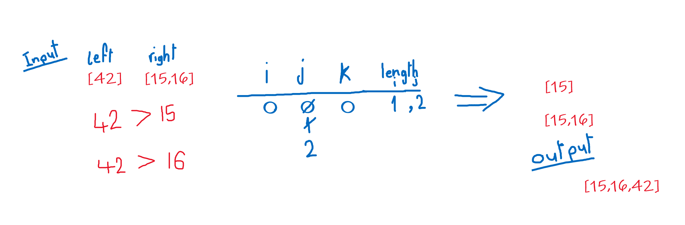
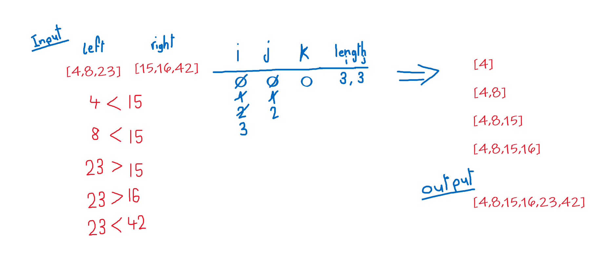

## Blog for code challenge 27: Merge Sort

The first part of the algorithm is the recursion, and in this part, it does something similar to the pre-order traversal in binary trees, it splits the array into 2 halfs, one is the right and the other is the left, and then recurse this operation until it can't do this anymore. After that it calls another method to order the sub array, and do that recursively to the calling method.

Now the first call for the second method will be on the far left below.

**Pass 1:**

Here, we only have one element in the left array, so we enter the loop once and insert it as it is.

**Pass 2:**

First, the left array has 4 and its less than what the first element in the right is, so we insert it into the new array. We increase i by one and it is the same as the length of its array, so we just add the rest of right elements in the right into the new array.

**Pass 3:**

We compare the first element from the left with the first element from the right, 8 is bigger than 4, so we add the one from the right into the new array, j now is 1 and we continue in the inner loop, 8 is less than 23 we insert it into the new array and i is now 1, which is the same as it's array length, so we just add the rest of the right array elements into the new array.

**Pass 4:**

Here, we only have one element in the left array, so we enter the loop once and insert it as it is.

**Pass 5:**

We only have 1 element in each sub array, so we compare them, the left array's element is bigger than the right array's element, so we add the one from the right into the output array, and increase j by one and it equals it's array length now, so we just add the elements of the left array into the new array.

**Pass 6:**

By comparing the first element from the left array, and the first element from the right element, 42 is bigger than 15 so we add the one from the right into the output array, and j is 1 now, in the second iteration happens the same thing and we add the one from the right again into the output array, and j is 2 now. We add the element from the left array into the output array, ordering the 3 elements just intended.

**Pass 7:**

Back to the root caller of the all the recursive calls: 
+ now we have 3 elements in each sub array, the left and the right, we compare the first ones, 4 is less than 15 so we add it into the output array and we add one to i.

+ second comparison, 8 is less than 15, we add 8 into the output array and now i equals to 2.

+ third comparison, 23 is bigger than 15, so for this one we add the element from the right array into the ouput array and j will equal 1.

+ fourth comparison, 23 is bigger than 16, and we add 16 into the output array, and increase j to equal 2.

+ last comparison, 23 is less than 42, so we add the last element in the left array into the output array, and this leaves i equals to 3 which is the same as the left array's length, therefore we add the remaining elements in the right array into the output array.

This will end the last inner loop and ends also the recursion and return an an ordered array ascendingly.

### Efficiency:
+ Time: O(n*Log(n))
We split each sub array into 2, which takes in half the length each time and this adds log(n) into the complexity, the inner loop which orders each sub array will iterate over each cell in the original array which adds O(n) into the complexity, making the time complexity O(n*Log(n))

+ Space: O(1)
We create small arrays each time with constant length, therefore the space complexity is O(1).