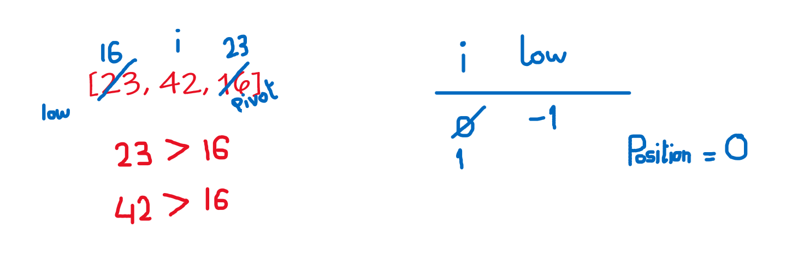

## Blog for code challenge 28: Quick Sort

**Partition** this method is called at first, which return the position of the pivot in it's right place while the elements in the right are higher and on the left are lower. All of this will happen in the partition method.

It assigns the last elemnt on the right to be the pivot, then it compares it to the rest of the passed array, and put all the higher elements on the right and the lower on the left. Then it exits the loop and places the pivot in the middle between the right and left side, which is the right place for it.

**Pass 1:**

The pivot will be 15, low is -1, and i is 0.
+ first element is 8 which is lower than the pivot so we add one to low and the swap will have no affect, and we add one to i.
+ Next iteration the same thing happens because 4 is lower than the pivot, and low is now 1.
+ 23 is higher than the pivot so we just add one to i.
+ 42 is is also higher than the pivot so we go to the next iteration.
+ 16 is higher than the pivot so we get out of the loop.

After that we swap between the pivot and the first higher element which is 23. Save the position of pivot and split the array into right and left and recusively call the quick sort again on the left and then on the right.

**Pass 2:**

Here we only have 2 elements, so we will have one iteration in the inner loop, 8 is less than 4 so the lower stays as -1 and we exit the loop. Then we swap between the low plus one which is 8 with the pivot which is 4 and we will have the sorted part here.

We won't have a recursive call here because it won't fullfill the condition (left \< right) and the recursion of the left side ends here.

**Pass 3:**

Here, the pivot is 16, low is -1, and we start looping:
+ first, we compare the pivot with the first element, 23 > 16 so we just skip to the next iteration.
+ 42 is also bigger than the pivot and we then exit the loop, leaving low as -1.

After looping we swap between (low + 1) and the pivot and the resulting array will be (16, 42, 23) and the pivot will be at positoin 0.

The quicksort will only work on the right side because it fullfills the condition (left \< right).

**Pass 4:**

Here do only one iteration, the pivot is 23 and its lower than the first element. We exit the loop and we swap between them. Here we call the left and right recursively and both exit immediately because neither of them fullfills the condition.

this will end the right side of the recursion, returning the rest of the array sorted, and we will have the final result:

        [4, 8, 15, 16, 23, 42]

which is the array sorted and without using any additional space.

### Efficiency:
+ Time: O(n*Log(n))
We split each sub array into 2, which takes in half the length each time and this adds log(n) into the complexity, the position array will iterate n times at first and that is why we multiply the complexity by n.

+ Space: O(1)
We didn't use any additional space in the memory.
