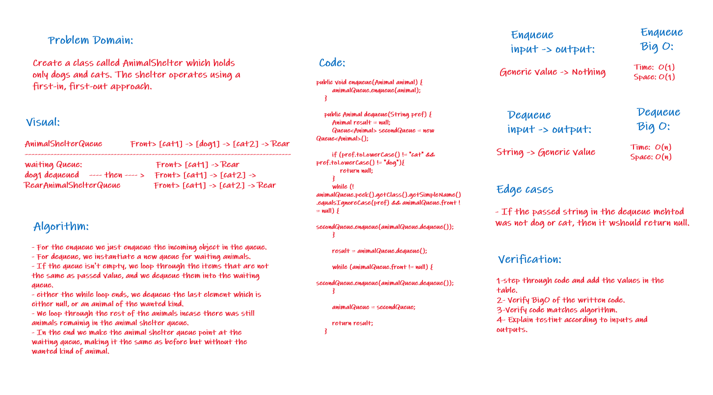

# Stacks and Queues
Implementing a stack and a queue classes as generic, with their basic methods.

## Challenge10
Implementation: Stacks and Queues

### Approach & Efficiency
+ **push**
Arguments: value
adds a new node with that value to the top of the stack with an O(1) Time performance.
+ **pop**
Arguments: none
    + Returns: the value from node from the top of the stack
    + Removes the node from the top of the stack
    + Should raise exception when called on empty stack
+ **peek**
    + Arguments: none
    + Returns: Value of the node located at the top of the stack
Should raise exception when called on empty stack
+ **is empty**
    + Arguments: none
    + Returns: Boolean indicating whether or not the stack is empty.

## Challenge11
Implement a Queue using two Stacks (PseudoQueue).

### Approach & Efficiency
+ **pseudoEnqueue**
  + Arguments: value
  + Inserts value into the PseudoQueue, using a first-in, first-out approach.

+ **pseudoDequeue**
  + Arguments: none
  + Extracts a value from the PseudoQueue, using a first-in, first-out approach.

### WhiteBoard process:

## Challenge12
First-in, First out Animal Shelter.

### Approach & Efficiency
+ Create a class called AnimalShelter which holds only dogs and cats.
+ The shelter operates using a first-in, first-out approach.
+ **enqueue**
  + Arguments: animal (animal can be either a dog or a cat object).

+ **dequeue**
  + Arguments: pref (If pref is not "dog" or "cat" then return null).

### WhiteBoard process:

 
## API
+ org.junit.jupiter.api.Test;
+ static org.junit.jupiter.api.Assertions.*;