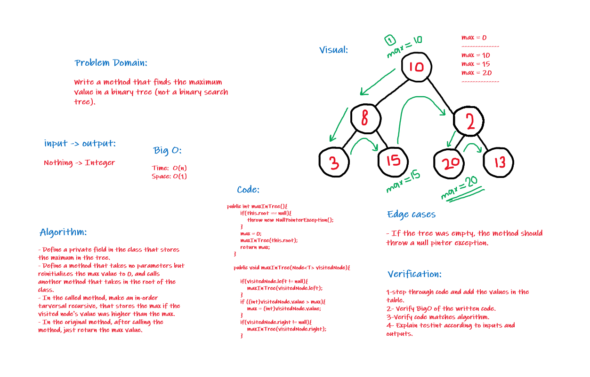

# Trees
The implementation of the tree data structure, and the essential methods related to it.

## Challenge15:
The basic implementation of the tree with these methods:
+ Traversals:
    + pre order
    + in order 
    + post order which returns an array of the values, ordered appropriately.

+ Add
    + Arguments: value
    + Return: nothing
    + Adds a new node with that value in the correct location in the binary search tree.
+ Contains
    + Argument: value
    + Returns: boolean indicating whether, or not the value is in the tree at least once.

## Challenge16:
Find maximum value
+ Arguments: none
+ Returns: number

**Find the maximum value stored in the tree. 
You can assume that the values stored in the Binary Tree will be numeric.**

### Challenge16 Whiteboard:

