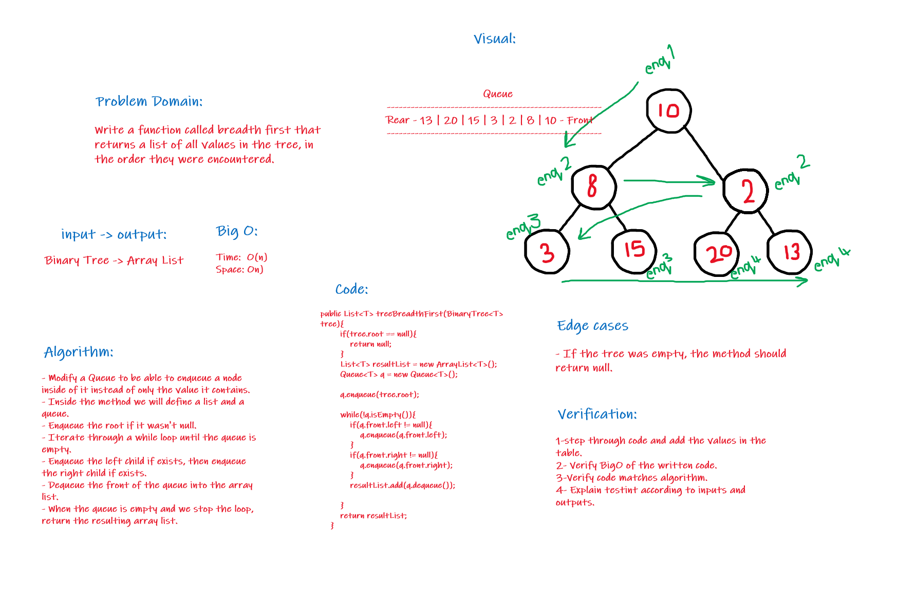
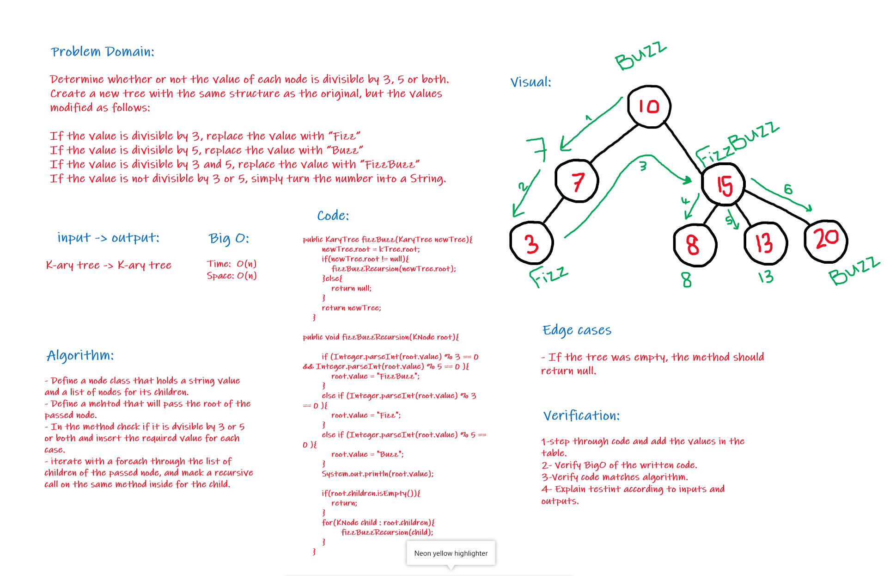

# Trees
The implementation of the tree data structure, and the essential methods related to it.

## Challenge15:
The basic implementation of the tree with these methods:
+ Traversals:
    + pre order
    + in order 
    + post order which returns an array of the values, ordered appropriately.

+ Add
    + Arguments: value
    + Return: nothing
    + Adds a new node with that value in the correct location in the binary search tree.
+ Contains
    + Argument: value
    + Returns: boolean indicating whether, or not the value is in the tree at least once.

## Challenge16:
Find maximum value
+ Arguments: none
+ Returns: number

**Find the maximum value stored in the tree. 
You can assume that the values stored in the Binary Tree will be numeric.**

### Challenge16 Whiteboard:

## Challenge17:
Write a function called breadth first
+ Arguments: tree
+ Return: list of all values in the tree, in the order they were encountered
*Traverse the input tree using a Breadth-first approach.*
  
### Challenge17 Whiteboard:

## Challenge18:
Write a function called fizz buzz tree
+ Arguments: k-ary tree.
+ Return: new k-ary tree.

Determine whether or not the value of each node is divisible by 3, 5 or both. Create a new tree with the same structure as the original, but the values modified as follows:

+ If the value is divisible by 3, replace the value with “Fizz”.
+ If the value is divisible by 5, replace the value with “Buzz”.
+ If the value is divisible by 3 and 5, replace the value with “FizzBuzz”.
+ If the value is not divisible by 3 or 5, simply turn the number into a String.

### Challenge18 Whiteboard:

